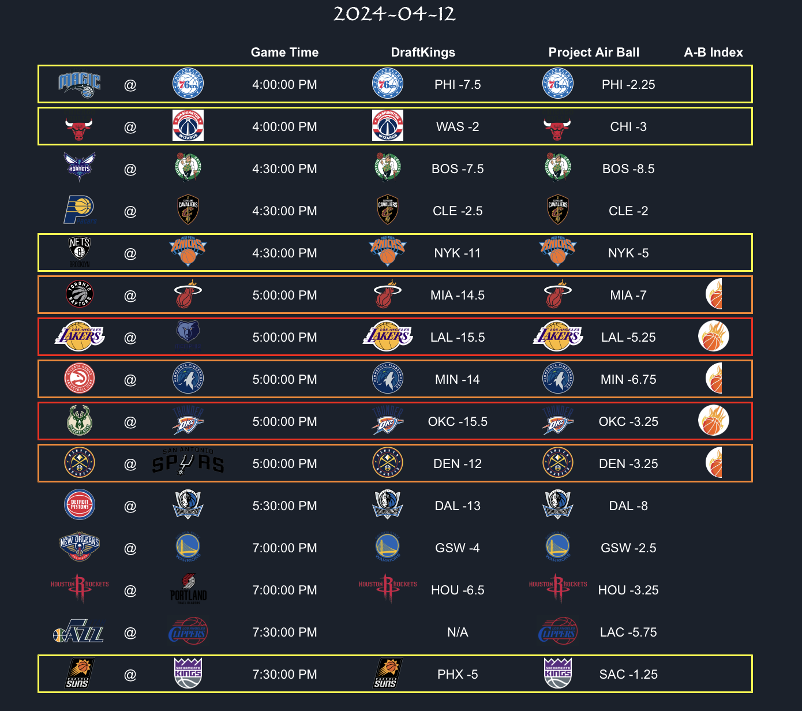
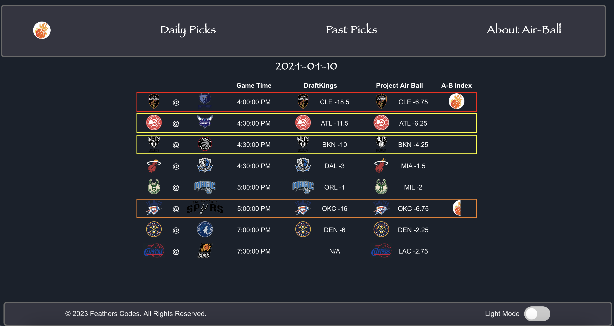
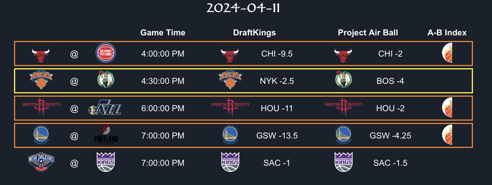
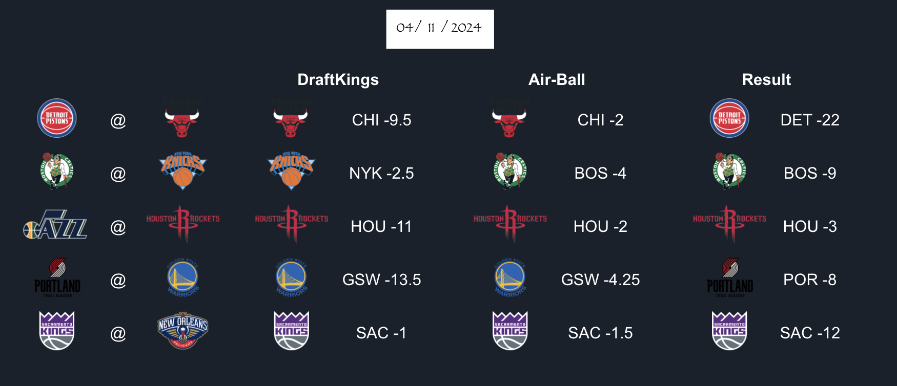

<div align="center">

</div>

# Project Air Ball
Project Air Ball is a machine learning model, seasonal data aggregation, and 
frontend built using data from the NBA API



## Website
https://air-ball.vercel.app

## Technology, Deployment, and Architecture

### Architecture:


### Frontend (air-ball)
```
Next.js with TypeScript
Hosted: Vercel
```

### Data and Prediction Backend (air-ball-stats)
```
Python with Type Hints
Hosted: Docker Container on AWS Lambda
Logging: EventBridge, CloudWatch, SMS
```

### Season Data and Air-Ball Predictions Database
```
DynamoDB on AWS
``````

### APIs
```
NBA API Python Module
Live Sports Odds on RapidAPI 
API-NBA on RapidAPI
Air-Ball API hosted on EC2 
```

## Project Air Ball ML Model
https://github.com/ryan-t-mitchell/nba_predictions

## Screenshots
### Full Website


### Daily Picks


### Record Picks

