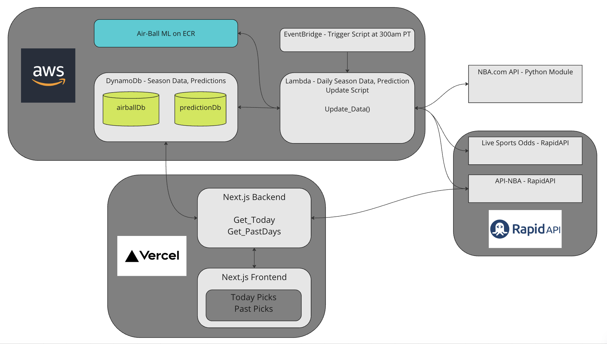

<div align="center">

</div>

# Project Air Ball
Project Air Ball is a machine learning model, seasonal data aggregation, and 
frontend built using data from the NBA API


## Website
https://air-ball.vercel.app

## Technology, Deployment, and Architecture
```
Frontend/Backend (air-ball) - Next.js w/ TypeScript
Data and Prediction (air-ball-stats) - Docker Container - Python w/ Type Hints
Database - DynamoDB
APIs - NBA API, Live Sports Odds, API-NBA, Air-Ball API
```
```
Next.js Static Content - Vercel
Data and Prediction - AWS Lambda, ECR, EventBridge, CloudWatch, SMS
Database - AWS DynamoDB
```
```
NOTE: Lambda/EventBridge tested but not fully set up due to nba api blocking AWS requests
```


## Project Air Ball ML Model
https://github.com/ryan-t-mitchell/nba_predictions

## Screenshots
### Full Website


### Daily Picks


### Record Picks

